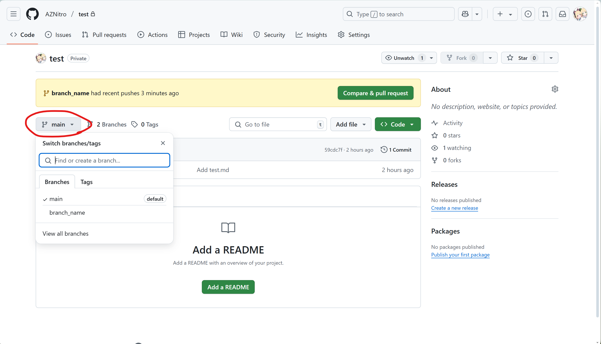
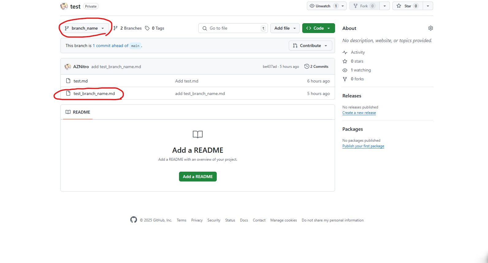
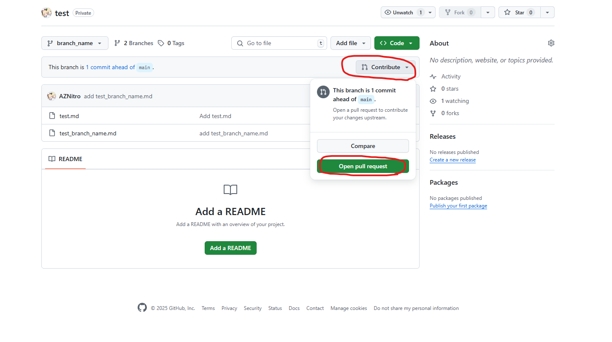
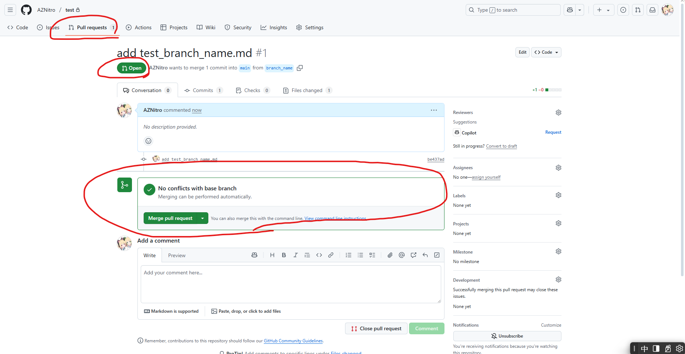
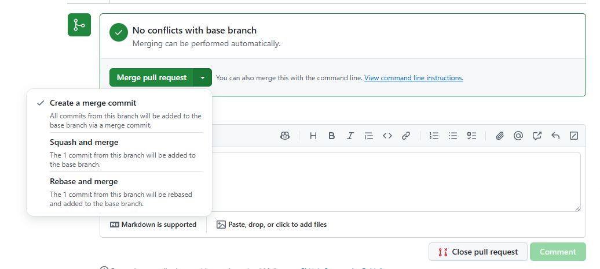
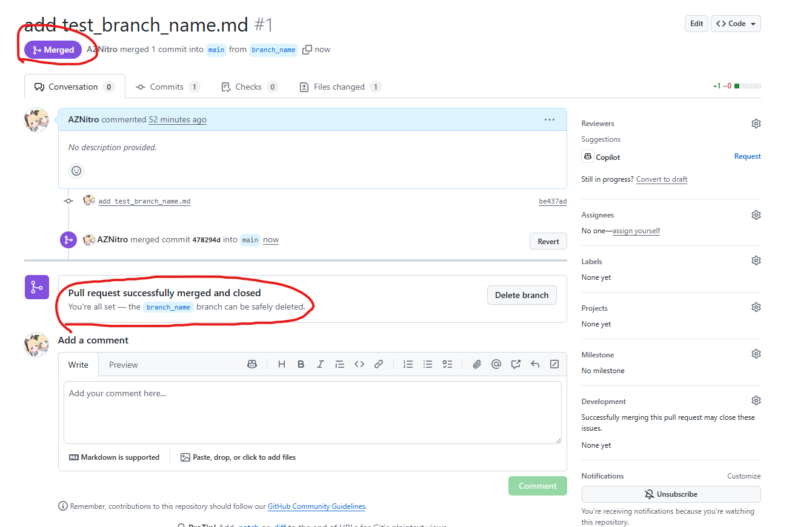
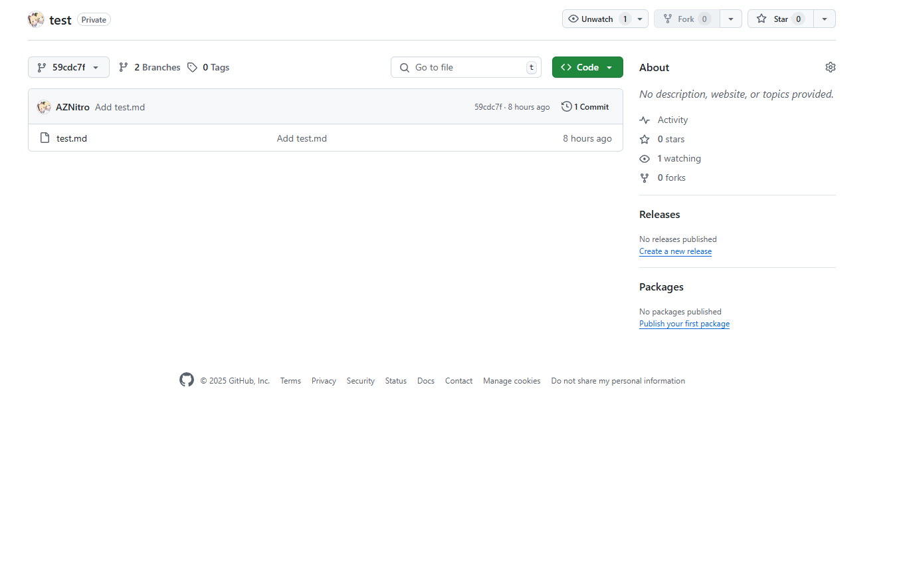
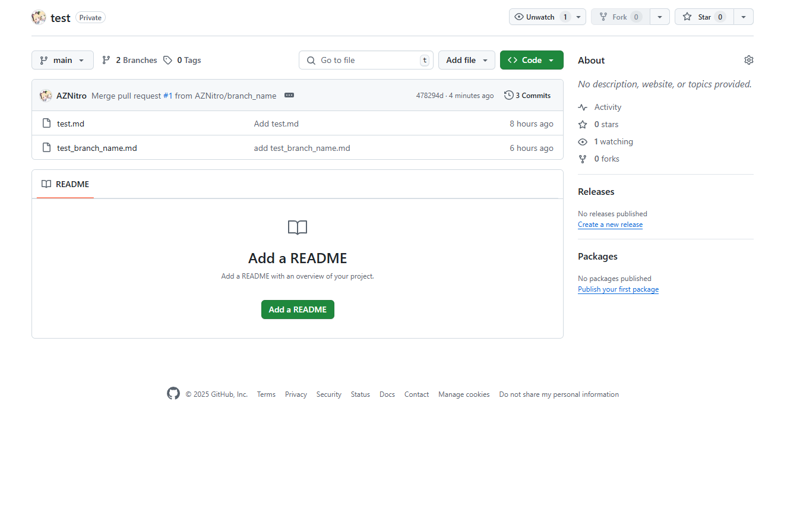

# 分支與合併

前面提到我們已經建立了main這個分支，它是我們的主要程式碼資料庫。當多人協作時，如果所有的功能開發和錯誤修復都直接在main分支上進行，很快就會導致程式碼混亂且難以管理。

Git的分支功能就像道路系統：
- main分支可以視為主要高速公路，負責日常運輸
- 當你想測試新功能（如自動化車牌收費系統）時，你不會直接在繁忙的主幹道施工
- 而是會開闢一條支線道路（新分支），在那裡進行所有的實驗和測試
- 確認一切正常後，再將這條支線併入(Merge)主幹道（合併回main）

這樣的工作流程才不會大家一起做，整個大亂。

## 建立與切換分支

接下來在Terminal輸入：

```bash 
git branch branch_name
```

這時我們就建立好了名為 branch_name 的分支。接下來需要切換到該分支：

```bash
git checkout branch_name
```

若顯示以下訊息，則表示已成功切換：

```bash
Switched to branch 'branch_name'
```

如果想切換回 main 分支，只需將 checkout 後面的參數改成 main：

```bash
git checkout main
```

Git 提供了一個更方便的方式同時完成建立分支和切換的操作：

```bash
git checkout -b test_branch
```

這個指令相當於執行了以下兩個指令：

```bash
git branch test_branch
git checkout test_branch
```

接下來介紹快速建立分支並於某分支下，假設我要在branch-name下又建立一個新的branch叫beta_branch
```bash
git branch beta_branch branch-name
```
這時就可以直接建立，不必再checkout該分支並建立分支。

## 如何正確撰寫Commit message
每次commit時，你都需要打一段message，即便現在Ai可以幫你下，但你自己還是得要知道原則。
主要有三點:
1.  使用祈使語氣
要聽起來像在下達命令
2.  讓訊息回答這個問題：(if apply to the codebase this commit will...)」
例如這個commit將會升級套件 (upgrade the packages)。
3.  不要講廢話，像是"今天喝杯咖啡，發現咖啡好苦"這種廢話，當然你要像"今天喝拿鐵，並修復bug"這樣也不是不行。

### 總而言之，重點要出來，不要拖臺錢!!!
好的好的 Commit Message 應該簡短、直接、使用祈使語氣，並清楚說明這個將對程式碼資料庫帶來什麼改變。

## 上傳新分支
接下來嘗試自己上傳看看，依照前面所教的(參考3)，試者自己上傳看看，若不會可看下方教學


### 前置:這邊我有先在branch_name新增test_branch_name.md檔案，以便後面查看不同分支差異
先查看目前在哪個分支
```bash
git status
```
從這裡可以知道目前在branch_name
```bash
On branch branch_name
nothing to commit, working tree clean
```
新增目前資料夾下的檔案，並寫下message。
```bash
git add .                                                
git commit -m 'add test_branch_name.md'
```


### 這裡切記，不要直接給我git push(參照3)

接下來設置好對應，若不想手動設置也請參照3有說明
```bash
git push --set-upstream origin branch_name
```


這樣就push成功，接下來我們打開Github並點分支




branch_name這個選擇，點入後你就會看到我稍早新增的，點入後可以發現確實多了test_branch_name.md





## 如何從遠端Repo pull下檔案
接下來說明如何做，正常情況下只需打
```bash
git fetch
```
先從server fetch下來後pull
```bash
git pull
```
但總會有意外發生，如果出現
```bash
There is no tracking information for the current branch.
Please specify which branch you want to merge with.
See git-pull(1) for details.

    git pull <remote> <branch>

If you wish to set tracking information for this branch you can do so with:

    git branch --set-upstream-to=origin/<branch> branch_name
```
這時要做就是將你本地的branch與遠端的Branch做連結，詳細參照3，這邊以我來說是這樣
```bash
git branch --set-upstream-to=origin/branch_name branch_name
```


## Merge 合併

### Github pull request
首先到branch_name的頁面下，並且找到Contribute按鍵，然後按下Open pull request




按下來後你會看到


打勾的部分是可以填入的，pull request後面的request是請求的意思，這邊可以填寫title跟description，這邊麻煩認真填寫，別亂寫，你是專案擁有擁有者，你同事寫我想合併請求寫我想喝咖啡，正常情況下你不會知道合併後會發生什麼，天曉得他要搞你。

你可往下滑


這邊介紹一個好用的功能，Github可以幫你比較兩個的差異，像目前我的main跟branch_name兩個分支，只差一個檔案而已，所以合併後會是+檔案和裡面的內容

填好後即可點擊送出請求。




由上而下我們可以知道，這時已經建立一個pull request並且為open狀態，然後下方圈起來是由檢查器檢查看是否有衝突，如果有，Git 會標記衝突文件，需要手動解決，才可合併。


如圖，檢查器確認此分支與目標分支之間沒有衝突，可以順利合併（在此範例中，差異僅為一個新檔案）。

### Merge pull request 差異
這邊你如果仔細看，會發現右邊有個箭頭可以點，點開後會有三個選項



### 1. Create a merge commit (建立合併提交)
- **做法：** 保留來源分支的所有變更紀錄，並在目標分支上新增一個合併點。
- **優點：** 完整保留開發歷史，合併時間點清晰。
- **缺點：** 歷史紀錄可能較亂，不易追蹤。

### 2. Squash and merge (壓縮並合併)
- **做法：** 將來源分支的所有變更壓縮成一個紀錄，再加到目標分支。
- **優點：** 歷史紀錄乾淨、線性，方便理解和還原。
- **缺點：** 丟失詳細的變更步驟。

### 3. Rebase and merge (變基並合併)
- **做法：** 將來源分支的變更逐一疊加到目標分支的最新進度上，然後快進合併。
- **優點：** 歷史紀錄非常整潔、線性，避免不必要的合併點。
- **缺點：** 會修改提交歷史，衝突解決可能較麻煩，合併時間點不明顯。

### 如何選擇？
- **Create a merge commit**：想看清楚來龍去脈，不怕歷史圖亂一點。
- **Squash and merge**：分支上有很多雞毛蒜皮的小修改，只想讓主線看到「搞定了這件事」的結果。
- **Rebase and merge**：想要線性歷史且保留細節，且不影響他人協作

## 合併後畫面
在你合併後在原本的pull request 你會看到




這邊就有顯示Merged合併了，並且關閉了這個請求，這時你回到Repo首頁，你會看到branch_name跟main已經合併了

### 合併前



### 合併後


