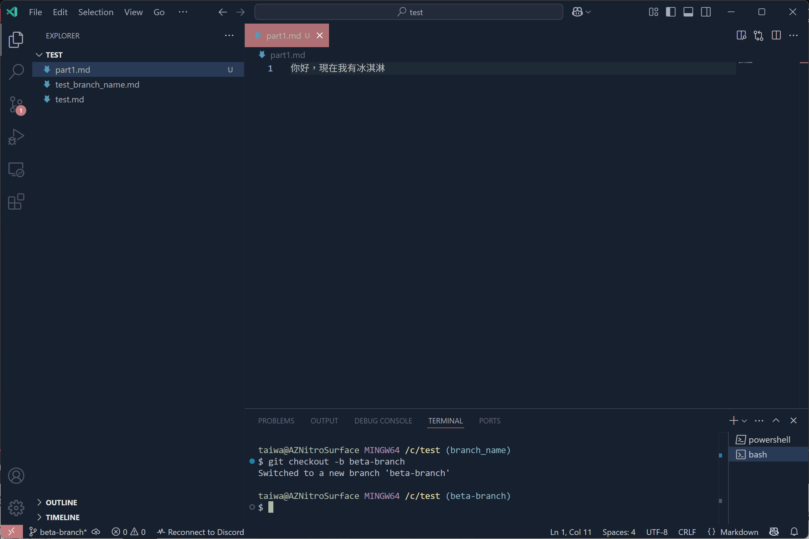
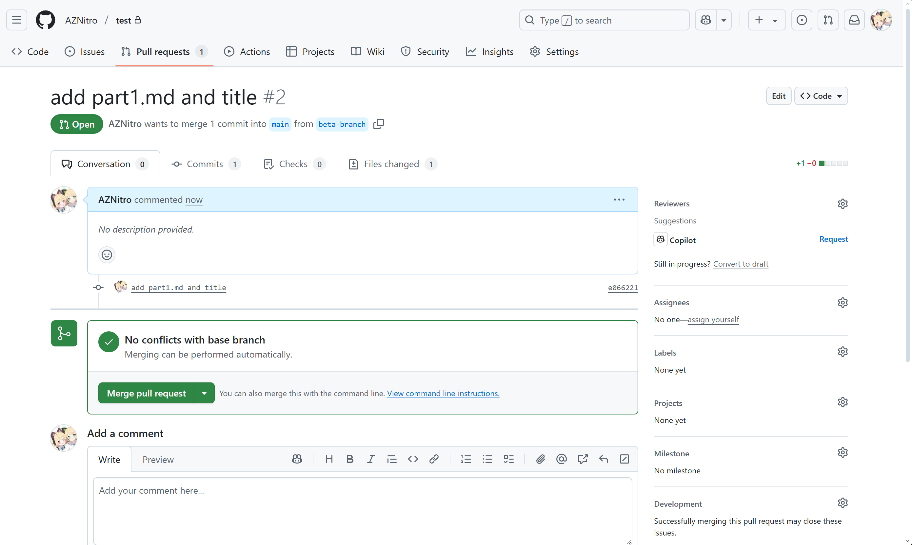
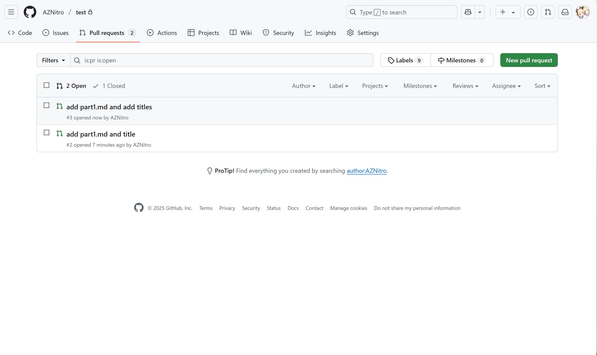
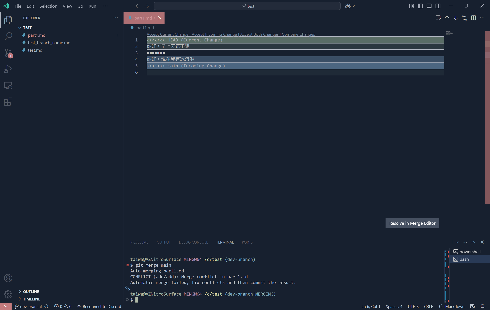
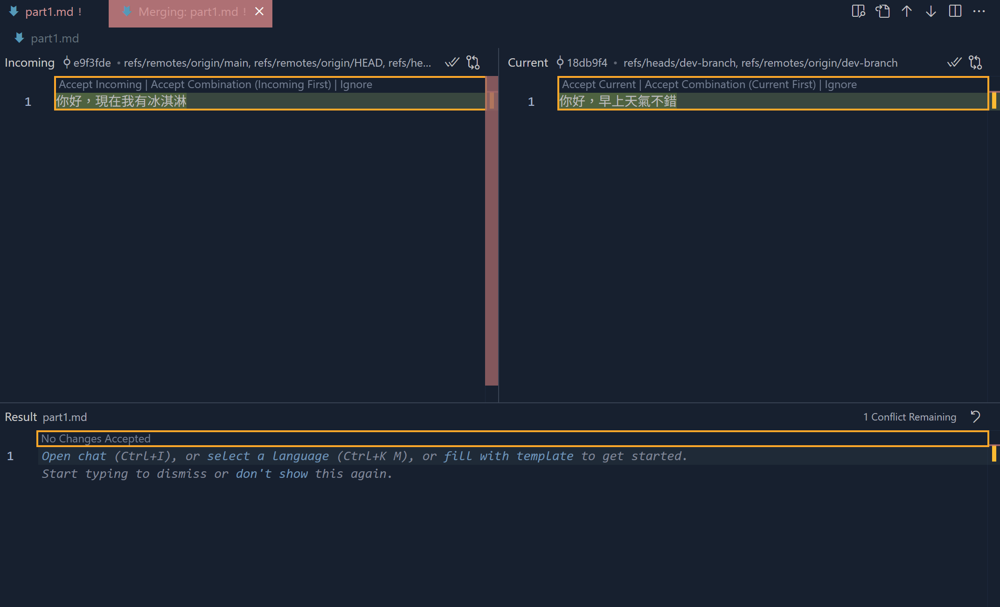
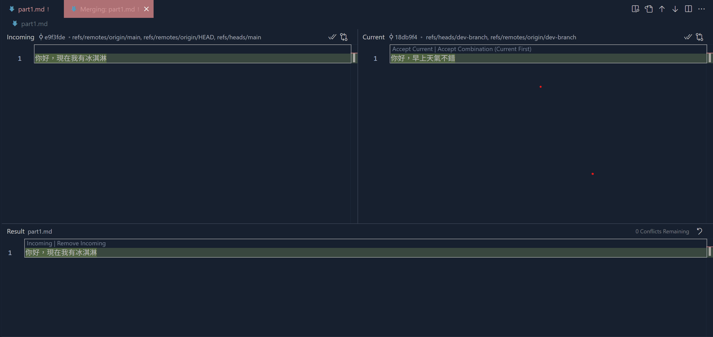
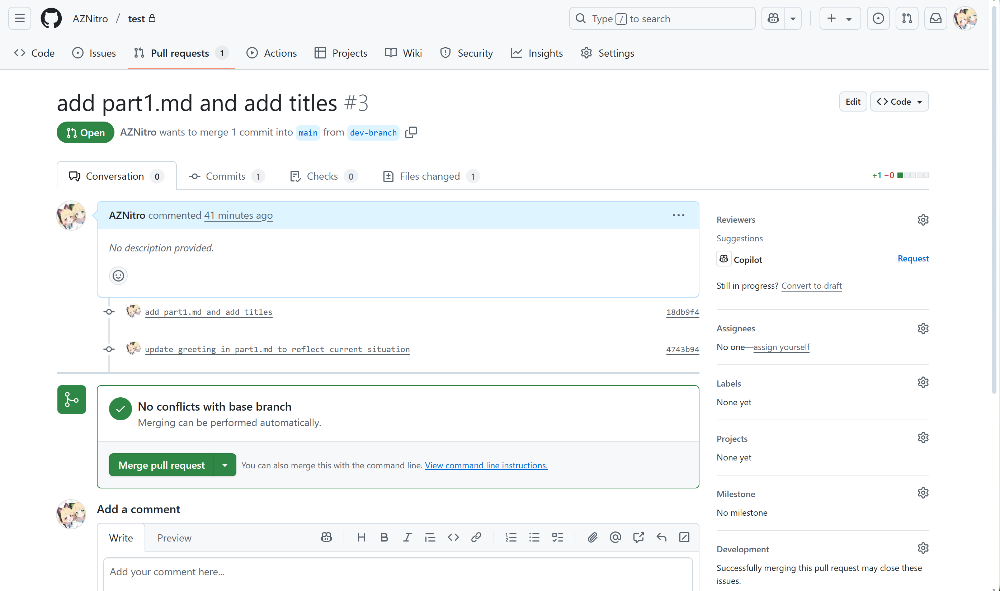

# 合併問題
稍早我們前面提到分支合併概念，我們也成功合併，這時如果你有注意到，兩個分支差異，只差在檔案不同而已，所以自然不存在問題，但今天如果你跟你的團隊同時編輯同個文件裡又剛好是同行呢?這時Git就不知道如何做，接下來我將帶你模擬一次。

## 建立兩個分支並且修改同檔案同行
我們先建立beta-branch並新增part1.md
```bash
git checkout -b beta-branch
```

在確認進入到beta-branch後，修改test.md內容，你可從terminal(Git bash)看到你目前在哪個分支
```bash
xxx@xxx MINGW64 /c/test (beta-branch)
```

這邊我新增part1.md並在裡面輸入一些字，新增完後嘗試合併他們(參照4)





先add,commit後merge
```bash
git add ./
```
```bash
git commit -m 'add part1.md and title'
```
後面一樣提出merge請求




接下來我們重複同樣的步驟，建立一個名dev-branch，並且也在part1.md裡面新增內容，步驟跟上面一樣。

### 記得要切換回main再建立分支!!


再來我們跳轉到pull request這，你會我看到我們建立了兩個pull request，下面是brta-branch上面是dev-branch





接下來我們先將beta-branch合併到main，然後再點開dev-branch合併請求你會看到conflict就產生了


由於我們稍早都在各自的branch建立同個檔案，也修改同行，如圖片也可以知道有衝突的檔案是哪個。

這邊建議若你是專案擁有者，可以提醒對方，修復這個問題，由於我就是author，這邊就不多贅述。


接下來我們回到IDE，並切換到main分支後，從remote repo push下來，我們來說明如何在IDE處理conflict


首先，確保在main branch
```bash 
git checkout main
```
接下來，進行pull
```bash
git pull
```
pull完後你應該會看到稍早由於beta-branch跟main branch已經合併，所以你會看到part1.md


接下來我們切換到dev-branch，並進行merge到main
```bash
git checkout dev-branch
```
然後打
```bash
git merge main
```
這時你會看到terminal會提示
```bash
xxx@xxx MINGW64 /c/test (dev-branch)
$ git merge main
Auto-merging part1.md
CONFLICT (add/add): Merge conflict in part1.md
Automatic merge failed; fix conflicts and then commit the result.

xxx@xxx MINGW64 /c/test (dev-branch|MERGING)
$ 
```
這幾行代表甚麼，我們一行一行看
```bash
Auto-merging part1.md
```
這行代表自動合併part1.md，沒問題
```bash
CONFLICT (add/add): Merge conflict in part1.md
Automatic merge failed; fix conflicts and then commit the result.
```
接下來問題就來了，這代表part1.md發生合併衝突，所以自動合併失敗，你必須解決衝突並提交結果。


畫面往上看，這時你的IDE正常會顯示，兩個檔案的差異





上面綠色所顯示的是目前分支(dev-branch)上的內容，下方藍色則是main，我們接下來要做的就是修復這個問題，點擊右下角`Resolve in Merge Editor`按鍵





這時左邊的區塊顯示的main分支，右邊則是dev-branch，正下面的是result(結果)

再來仔細看看左邊字上面有三個選項


1. Accept Incoming 接受傳入的變更
2. Accept Combination Incoming First 接受組合，傳入先
3. Ignore 滾


右邊則是


1. Accept Current 接受目前
2. Accept Combination Current First 接受組合，組合先
3. Ignore 滾

這幾個選項你都可以點看看，要依據情況選擇最好的組合，這邊我們示範使用Accept Incoming，你會看到Result這邊改變了





Result這會顯示最後的結果，若你確認ok，就可以進行add commit 和push的動作了。

在你確認完後，回到Github頁面，你可以看到這邊合併已經可以按了，同時中間也看到我們稍早commit的紀錄



接下來按下Merge pull request，就正式完成了。