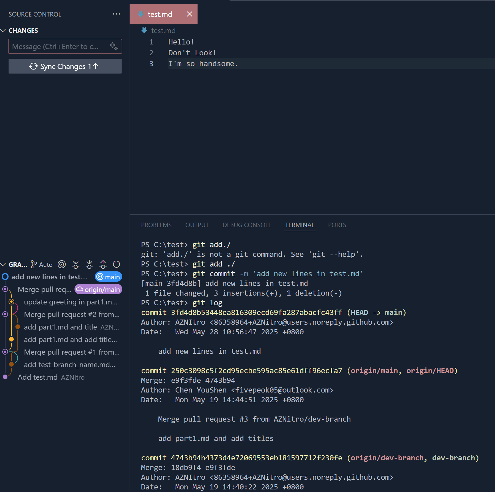
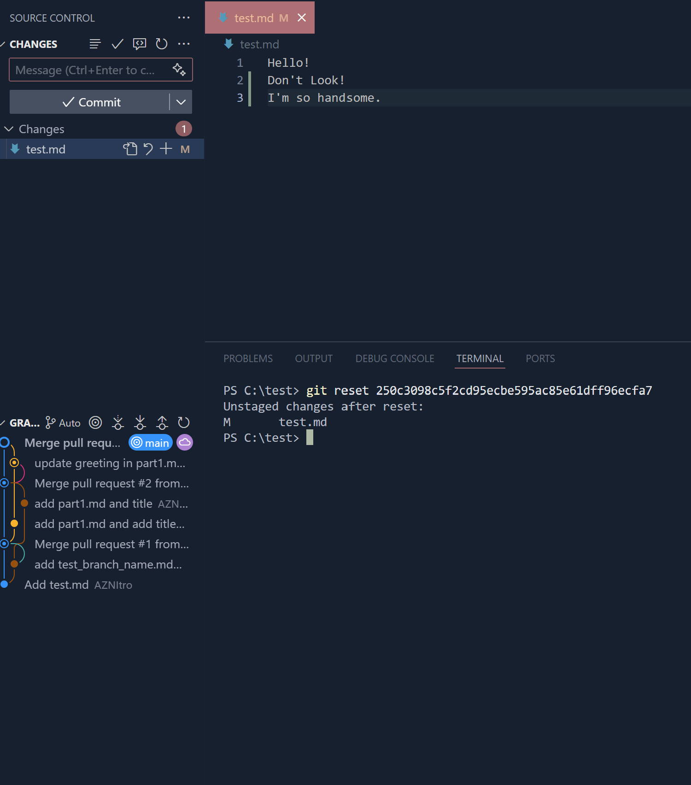
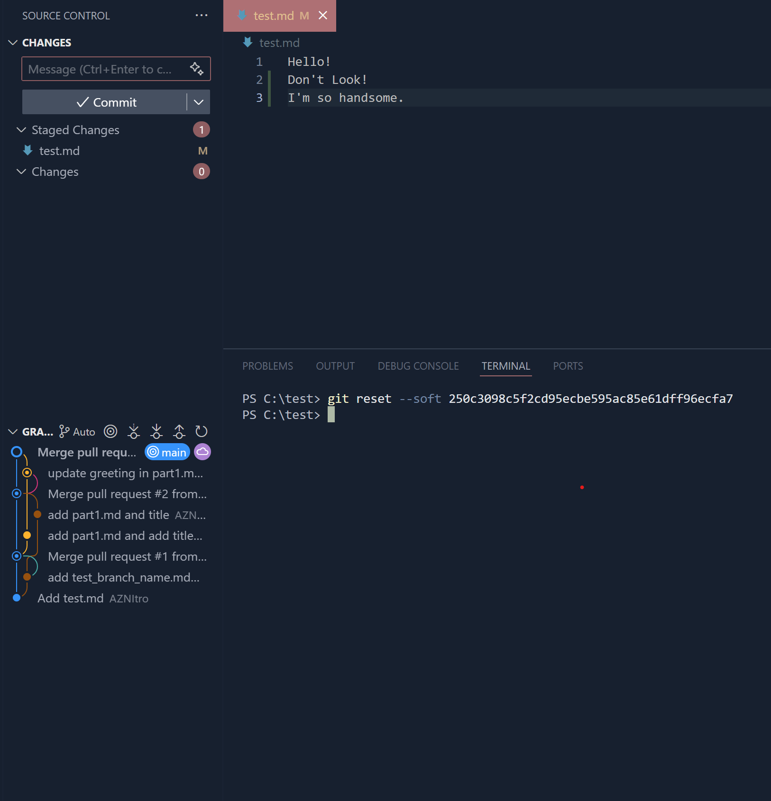
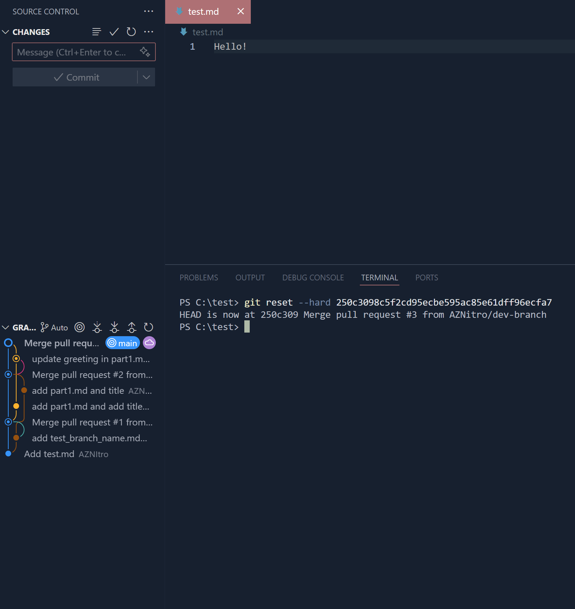
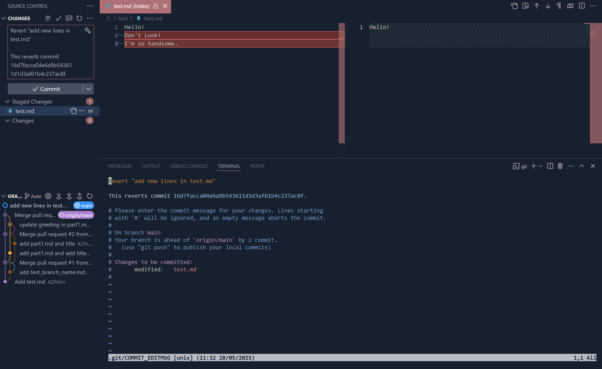
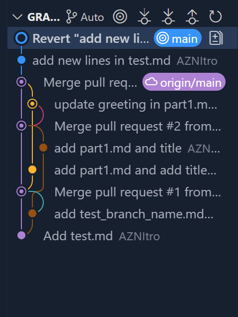
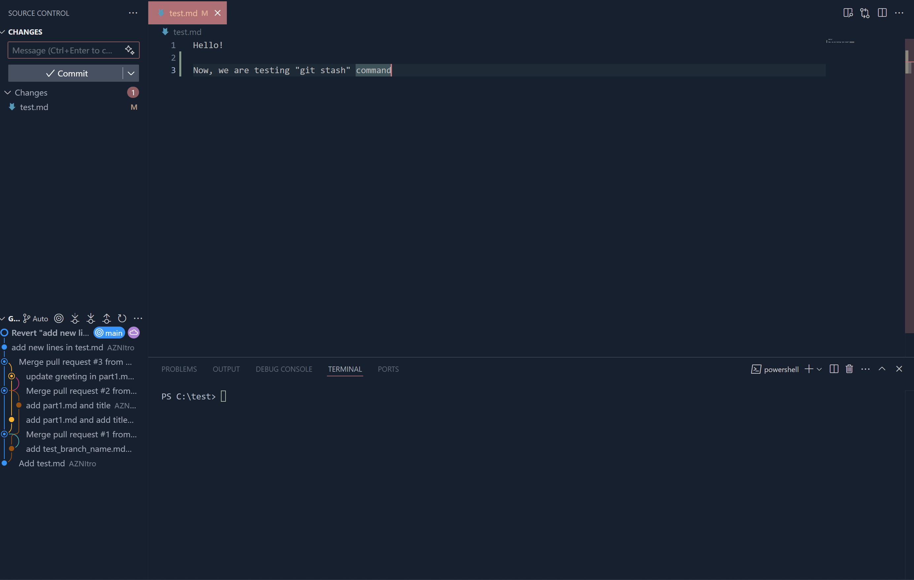
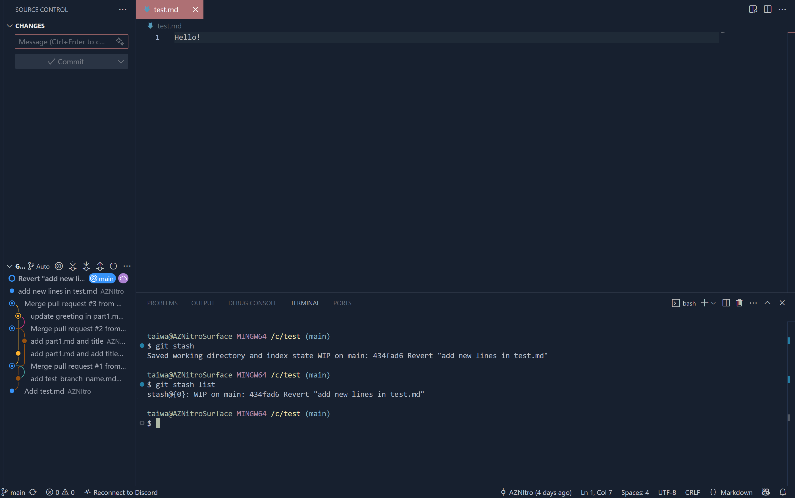

# 進階操作

## Reset command

前面教到如何commit，不知有沒有想過，commit後可以撤銷嗎？  
答案是可以，這邊將教三種方式，同時我先不說，看看你能不能看出差異。

這邊我直接修改test.md內容，如圖為修改前的樣子，同時我已經先新增一行，並commit，以觀察之間的差異。



**附註**：如果不知道啥是commit id 請參照第二章

### mixed reset
第一個是最常見的reset，指令為：
```bash
git reset <commit-id>
```



### soft reset 
```bash
git reset --soft <commit-id>
```



### hard reset
```bash
git reset --hard <commit-id>
```



聰明的你，應該有看出差異，但這裡我用表格簡單表示。

| Reset 模式 | 暫存區 (Staging Area) | 工作目錄 (Working Directory) | 使用時機 |
|-----------|----------------------|----------------------------|----------|
| **soft** | 保留 | 保留 | 只想修改 commit message，保持所有變更在暫存區 |
| **mixed** (預設) | 清空 | 保留 | 想要重新選擇要 commit 的檔案，需要重新 `git add` |
| **hard** | 清空 | 清空 | 完全放棄所有變更，回到指定 commit 的狀態 |

### 詳細說明

- **暫存區 (Staging Area)**：執行 `git add` 後檔案存放的區域，準備要 commit 的檔案
- **soft**：最溫和的重置，只移動 HEAD，適合修改 commit message
- **mixed**：最常用的重置，會清空暫存區但保留工作目錄的變更
- **hard**：最徹底的重置，完全丟棄所有變更，慎用！

### 問題來了，本地這樣搞可以，你遠端這樣搞，你想被搞嗎?

仔細想想，無論是哪個reset都會修改到分支歷史，如果多人協作問題不就來了嗎?

所以有了revert

## Revert command

直接實作吧，我們一樣回到reset前的畫面。


```bash
git revert main  ##這裡main是直接revert到目前遠端main分支的頭，正常請更換成commit id
```

圖片中，我們可以看到熟悉的畫面，他們可以方便我們修改，



接下來修改完後，要離開，就在terminal 先按 Ctrl+: 然後打qa! 按下Enter,跟Vim的操作方式一致。

這時你往左邊的分支看，你會發現多了他自動commit上去新的了。



到這裡我們可以知道，revert會建立新的commit，同時你點入會發現他也保留了完整的更動歷史，方便自己以及團隊查，跟Reset最大不同也就在這，他不會更動分支歷史，反而是建立新commit告訴你改什麼，保留最大完整。以下提供比較圖。

### Git Reset vs Revert 比較表

| 比較項目 | Reset | Revert |
|---------|-------|--------|
| **操作方式** | 移除/回退 commit | 建立新的 commit 來撤銷變更 |
| **歷史記錄** | ❌ 修改/刪除歷史 | ✅ 保留完整歷史 |
| **安全性** | ⚠️ 有風險（特別是已推送的 commit） | ✅ 安全，不破壞現有歷史 |
| **適用時機** | 本地未推送的 commit | 已推送到遠端的 commit |
| **團隊協作** | ❌ 不適合共享分支 | ✅ 適合團隊協作 |
| **推送方式** | 需要 `--force` 強制推送 | 正常 `git push` |
| **可追蹤性** | ❌ 原始變更記錄消失 | ✅ 保留完整變更歷史 |
| **回復難度** | 困難（需要 reflog） | 容易（可再次 revert） |

### 使用場景比較

| 場景 | Reset | Revert |
|------|-------|--------|
| **修改 commit message** | ✅ `git reset --soft` | ❌ 不適用 |
| **重新整理本地 commit** | ✅ 適合 | ❌ 不適用 |
| **撤銷已推送的錯誤** | ❌ 危險 | ✅ 推薦 |
| **多人協作環境** | ❌ 避免使用 | ✅ 首選 |
| **保留追蹤** | ❌ 歷史會消失 | ✅ 完整保留 |

### 指令範例

```bash
# Reset (本地未推送)
git reset --soft HEAD~1   # 保留暫存區
git reset --mixed HEAD~1  # 清空暫存區（預設）
git reset --hard HEAD~1   # 完全丟棄變更

# Revert (已推送)
git revert HEAD           # 撤銷最新 commit
git revert abc123         # 撤銷指定 commit
git revert HEAD~2..HEAD   # 撤銷多個 commit
```

## Stash Command

前面教你如何復原，以及提交後該如何正確修改，接下來我們到更前面，如果你連打算commit都沒有，還在修改檔案這階段。

突然，你收到訊息，要你去改另一個檔案修復bug時，可以怎樣做?

首先，到我們的IDE，這邊可以看到我已經新增一行，``"Now, we are testing "git stash" command"``



這時我們在terminal打

```bash
git stash 
```
或
```bash
git stash save "your_comment"
```

後者可以寫下comment，你也可以不寫，Git也會預設幫你，接下來往下看



這邊你可以看到，Git已經將工作目錄和暫存區的變更儲存到儲藏區域了，同時我們也回到你修改前的狀態了。

### 問題來了，怎麼回去? 很簡單，關閉你的IDE(X

當然不是，現在需要的是復原，如果你剛剛有仔細看圖片，有發現我也打了
```bash
git stash list
```
上面有行寫
```bash
stash@{0}: WIP on main: 434fad6 Revert "add new lines in test.md"
```
stash@{0}代表的是編號，0代表是最新的，這時需要開啟只需要打
```bash
git stash apply stash@{0}
```

就可以開始到上次你儲存的進度了，像是Xbox的quick resume，只不過手動版XD。

### 這邊注意一下，有可能會需要處理合併衝突問題，若不懂可回頭看5

## 總結

透過本章節的學習，我們深入探討了 Git 的三個重要進階操作：Reset、Revert 和 Stash。這些工具各有其適用場景，正確使用它們能讓版本控制更加靈活且安全。

**Reset** 是強大但需謹慎使用的工具，主要適用於本地尚未推送的 commit。三種模式（soft、mixed、hard）分別對應不同的使用需求，從修改 commit message 到完全放棄變更都能勝任。

**Revert** 則是團隊協作環境下的首選，透過建立新的 commit 來撤銷錯誤，既能保持完整的歷史記錄，又能安全地修正已推送的問題，是維護專案穩定性的重要手段。

**Stash** 功能如同工作現場的「暫存槽」，讓開發者能夠快速切換工作內容而不丟失當前進度，特別適合處理緊急修復或需要暫時切換分支的情況。

掌握這些進階操作不僅能提升個人開發效率，更重要的是在團隊協作中避免常見的版本控制陷阱。記住：**在共享分支上使用 Revert，在本地分支上可選用 Reset，需要暫存工作時就用 Stash**。正確的工具選擇是 Git 專家與初學者的關鍵差異所在。

